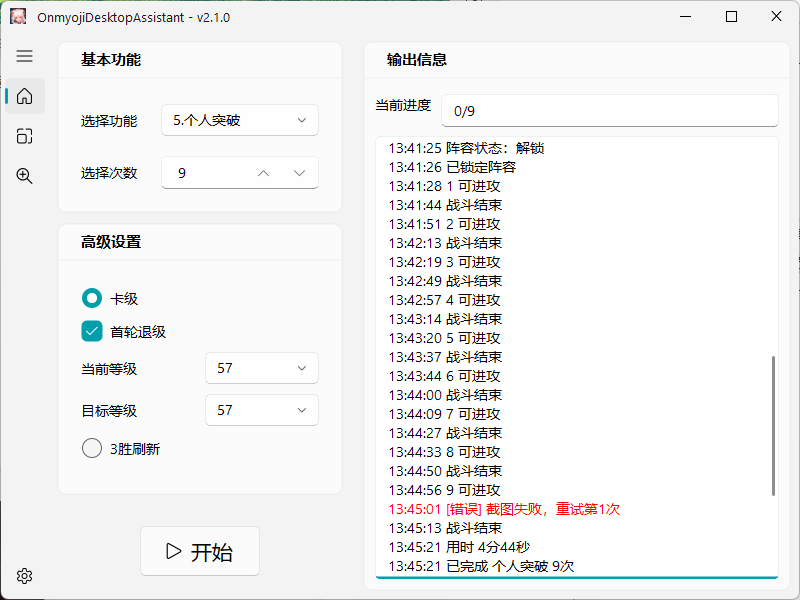
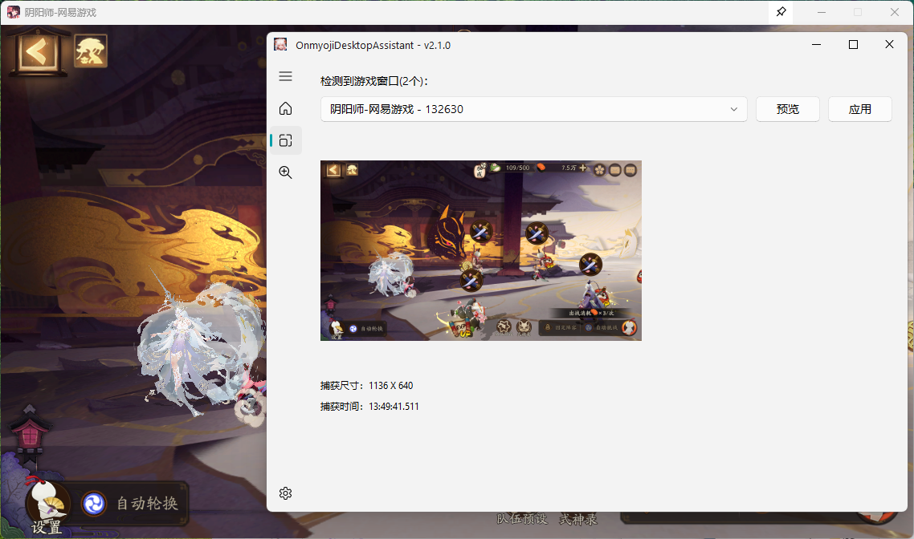
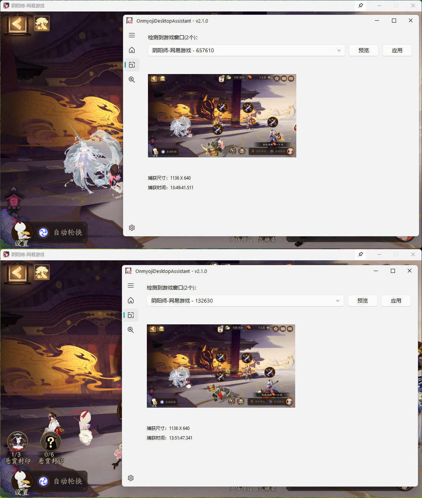

# OnmyojiDesktopAssistant


[](https://github.com/AquamarineCyan/OnmyojiDesktopAssistant/releases/latest)

## 简介

本项目仅支持阴阳师桌面版使用，同时支持前台和后台交互方式。

## 帮助文档

[帮助文档](https://docs.qq.com/doc/DZUxDdm9ya2NpR2FY)

[交流群](https://qm.qq.com/q/T5pnZ5tGAs)

## 主要功能

1. 御魂副本
   - 十层/悲鸣/神罚
   - 组队/单人
   - 组队司机/打手
2. 组队永生之海副本
    - 适配司机/打手
3. 业原火副本
4. 御灵副本
5. 个人突破
    - 卡级/退级
    - 3胜刷新
6. 寮突破
    - 90%进度提前结束
7. 道馆突破
    - 等待系统进入/手动挑战/正在进行中
    - 仅支持挂机阵容
8. 普通召唤
    - 十连灰票
9. 百鬼夜行
    - 清票
10. 限时活动
    - 仅适用于月度活动的爬塔，支持体力爬塔300次/周年庆999次
11. 日轮副本
    - 组队/单人
    - 组队司机/打手
12. 单人探索
    - 准备自动轮换
    - 自动拾取结束后的掉落宝箱
13. 契灵
    - 探查
    - 结契
14. 觉醒副本
15. 六道之门速刷
    - 目前仅适配：椒图，4柔风，不打星之子的阵容，需要手动勾选“不再提醒”
16. 斗技自动上阵
    - 挂机阵容，自动上阵
17. 英杰试炼
    - 源赖光/藤原道长
    - 经验本/技能本
18. 绘卷刷分
    - 采用单人探索+个人突破的组合方式
---

- [x] 全局悬赏封印
- [x] 记忆上次所选功能
- [x] 识别多种战斗主题
- [x] 支持后台交互 :sparkles:
- [x] 有效词条分析
- [x] 游戏窗口管理


## 使用方法

### 1. 安装桌面版

 - 旧版桌面版
   - [NGA下载地址](https://nga.178.com/read.php?tid=29661629)
 - 新版桌面模拟器，通过官方MuMu专版下载，支持新区账号登录
   - [阴阳师桌面模拟器](https://yys.163.com/zmb/)
   - [【阴阳师】幼教级新桌面版安装及多开教程](https://www.bilibili.com/video/BV1rEUiBdEL6)
 - 新版与旧版仅窗口名称区别，其余功能一致。


###  2. 运行本软件

  1. 前往 [releases](https://github.com/AquamarineCyan/OnmyojiDesktopAssistant/releases/latest)
  2. 下载最新压缩包 `OnmyojiDesktopAssistant-2.x.x.zip`
  3. 解压后双击 `OnmyojiDesktopAssistant.exe` 即可运行。
> [!NOTE]
> 需要解压到英文路径下

### 3. 源码编译运行（不推荐）

<details><summary> 不推荐，需要自行安装Python环境 </summary>

1. 下载源码  
    ```bash
    git clone https://github.com/AquamarineCyan/OnmyojiDesktopAssistant.git
    ```

2. 安装依赖 
    - venv 方式  
    `pip install -r requestments.txt`
    - poetry 方式  
    `poetry install`

3. 添加文字识别依赖库

    从 [releases](https://github.com/AquamarineCyan/OnmyojiDesktopAssistant/releases/latest) 下载 `OnmyojiDesktopAssistant-2.x.x.zip`， 解压后找到`ocr`文件夹放在项目根目录下

4. 运行/调试

    - 使用管理员程序启动你的IDE，如 `PyCharm`、`VSCode` 。
    - 如果使用 `VSCode` 调试，已经提供了对应的调试文件，选择 `Project` 调试模式启动。
    - 其他IDE：终端运行 `python main.py` 。

5. 打包

    打包配置保存在 `main.spec` ，使用 `pyinstaller main.spec` 命令，会在根目录下生成 `output` 文件夹。

</details>

## 程序目录

```
|- OnmyojiDesktopAssistant # 根目录
   |- data # 用户数据
      |- myresource # 自定义素材，用法见 [#注意事项](#注意事项)
      |- screenshot # 截图（百鬼夜行结束会生成）
      |- config.yaml # 配置文件
      |- update_info.json # 更新记录
   |- lib # 运行库
   |- log # 日志
   |- ocr # 文字识别库
   |- resource # 素材文件
   |- OnmyojiDesktopAssistant.exe # 主程序
```

## 主界面



## 后台交互模式


   
使用后台交互模式可以释放鼠标的使用，同时保证游戏不能被最小化，允许被其他应用遮挡。
   
验证是否可以正常使用后台交互模式：
1. 启动本软件。
2. 切换到 `设置` 页签，勾选 `后台` 交互模式。
3. 切换到 `窗口管理` 页签，点击 `预览` 按钮，能够显示游戏窗口截图，表明可以正常使用后台交互模式。
4. 如果游戏窗口截图为黑屏，在 `设置` 页签切换 `后台截图模式` 后重试。如果所有的截图模式都显示黑屏，请改为 `前台交互模式`。


## 多开

1. 启动多个游戏窗口
2. 启动多个本软件，切换到 `设置` 页签，推荐启用 `后台` 交互模式，避免多个软件互相争夺鼠标控制。使用后台交互模式后，在 `窗口管理` 页签点击 `预览`
2. 切换到 `窗口管理` 页签，点击 `预览` 按钮，选择对应窗口，确认每个软件检测到对应的游戏，并点击 `应用` 按钮。




## 日服

1. 下载下方 `Assets` 的 `resource_ja.zip`
2. 解压后，复制到软件根目录，与自带的 `resource` 文件夹同级
3. 软件设置 - `游戏服务器`  改为 `日服` ，重启
4. 无报错信息即可使用
5. 目前仅适配 `单人御魂副本` ，资源及测试由 [@huahua1125](https://github.com/huahua1125) 提供

## 注意事项

**请自行合理使用，所产生的一切后果自负**

1. 基于图像识别和文字识别，支持多种战斗主题，建议游戏窗口不要过小，推荐强制缩放。

2. 推荐在功能界面开始任务。例如组队御魂类副本，在组队房间内开始任务。

3. 移动游戏窗口后，会自动更新窗口。

   多开游戏窗口，需要手动点击`游戏检测`，会检测位于较上层的游戏窗口。

   针对常见`1920*1080`分辨率下的非100%缩放，可修改游戏路径下的`Launch.exe`属性，避免每次强制缩放
   ```bash
   属性 - 兼容性 - 更改高DPI设置 - 替代高DPI缩放行为为`应用程序`
   ```

4. 如果需要自定义识别的素材，可参考 `resource` 下的分类方法，在 `/data/myresource` 给出相同路径的素材即可。

    例如需要使用自定义的 `/resource/huodong/title.png` 文件，则新建 `/data/myresource/huodong/title.png` 即可。程序将优先使用用户给定的自定义素材。

## 感谢

[raoyutian/PaddleOCRSharp](https://gitee.com/raoyutian/PaddleOCRSharp) 基于paddle的本地离线OCR v3识别库

## 更新记录

[CHANGELOG.MD](CHANGELOG.MD)
